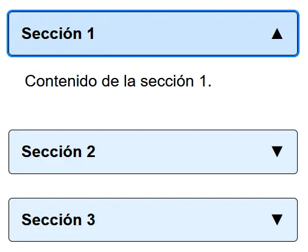

# Acordeones

## Qué es y para qué sirve un acordeón

En diseño web, un acordeón (o _accordion_, en inglés) es un componente de interfaz de usuario (UI) que permite mostrar y ocultar secciones de contenido. Su funcionamiento se asemeja al instrumento musical del mismo nombre: al hacer clic en un encabezado o título, se «expande» una sección de contenido relacionada, mientras que, en paralelo, otras secciones pueden contraerse.

## Características principales de un acordeón

- Estructura jerárquica: cada elemento del acordeón presenta un título o encabezado y un bloque de contenido asociado.
-Interactuar con los títulos, los cuales funcionan como botones, permite alternar entre mostrar u ocultar el contenido asociado.

## Utilidad, uso previsto y consideraciones de diseño

- Pensado para mostrar una gran cantidad de información en un espacio reducido.
- Facilita el reconocimiento y acceso a los bloques significativos de la página de forma similar a un sumario.

Se acostumbra a utilizar cuando se requiere implementar:

- Un bloque de preguntas y respuestas. Por ejemplo, una página de preguntas frecuentes (FAQ).
- Formularios largos con bloques bien diferenciados.
- Menús de navegación.

No debe utilizarse cuando:

- Todo el contenido de la página es relevante para los usuarios.

Ten en cuenta que:

- El uso de acordeones incrementa el coste de interacción (más clics para realizar tareas como abordar el contenido).
- Algunas partes del contenido pueden pasar desapercibidas para los usuarios.
- El contenido colapsado no se imprimirá a no ser que establezcas estilos alternativos en una hoja de estilos CSS pensada para impresión.

## Requisitos de accesibilidad

- Los títulos deben ser claros y significativos.
- Los elementos interactivos del acordeón deben ser accesibles tanto mediante el ratón, como a través del teclado (navegar al siguiente elemento interactivo con la tebla Tab, navegar al elemento interactivo anterior con la combinación Majúsculas + Tab y expandir o contraer cada bloque con la tecla Enter o la barra de espacio).
- La integración de roles y atributos ARIA facilita a los lectores de pantalla entender la relación entre los títulos y su contenido.
- El contenido de los acordeones debe respetar la jerarquía del contenido del documento. Es decir, si el contenido de cada bloque presenta bloques que requieren un encabezado, estos deben respetar la jerarquía de la página.
- Los elementos interactivos deben contar con un indicador visual claro del estado expandido o contraído.
- Los elementos interactivos deben contar con una indicación visual del foco al expandir uno de los bloques de contenido.

## Criterios de conformidad WCAG relacionados

- 2.1.1: Teclado (nivel A)
- 4.1.2: Nombre, rol, valor (nivel A)

## Código HTML

Se utilizan los atributos y roles ARIA siguientes:

- `aria-expanded`: que presenta el valor true o false según si el acordeón se encuentra colapsado o expandido.
- `aria-controls`: que permite vincular semánticamente cada botón con el bloque de contenido que activa a través de su atributo id.
- `role="región"`: que define una sección de contenido independiente que los lectores de pantalla pueden identificar como una región navegable. La sección cuenta además con un título que se vincula mediante aria-labelledby (ver a continuación).
- `aria-labelledby`: que permite vincular semánticamente cada bloque de contenido con el título de cada bloque a través de su atributo id.
- Si el contenido del acordeón presenta una lista de definiciones, se puede optar por utilizar una estructura basada en los elementos semánticos `<dl>`, `<dt>` y `<dd>`.
- Si se desea optar por una solución completamente nativa sin necesidad de JavaScript, es posible utilizar la pareja de elementos `
` y `
`, definidos por la W3Schools como: The `
` tag defines a visible heading for the `
` element. The heading can be clicked to view / hide the details.

## Contenido de esta carpeta

- `acordeon-bootstrap`: ejemplo que parte de la estructura básica propuesta por Bootstrap.
- `acordeon-estructura-dl-bootstrap`: un segundo ejemplo basado en Bootstrap que presenta una lista de definiciones usando `<dl>`, `<dt>` y `<dd>`.
- `acordeon-sin-js`: ejemplo usando solo HTML y CSS, sin JavaScript ni frameworks _frontend_.

## Artículo relacionado

Explicación detallada de la solución en el post:  
[a11y tips #1: acordeones accesibles](https://www.rubenalcaraz.es/pinakes/accesibilidad/a11y-tips-acordeones-accesibles/)
